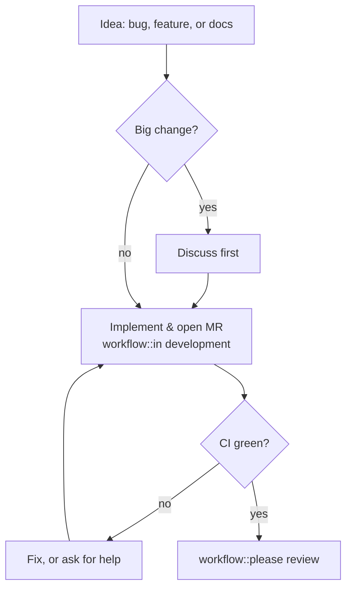

# Contributing to OGSTools

Thanks for your interest in `ogstools`! Here's how to get involved.

## Reporting issues and bugs

- Open to everyone: file an issue on the [GitHub mirror](https://github.com/ufz/ogstools/issues).
- Preferred: If you already have (or can request) access to the GitLab instance: use the [GitLab issue tracker](https://gitlab.opengeosys.org/ogs/tools/ogstools/-/issues) instead.

Found a security vulnerability? Please don't file a public issue — email <info@opengeosys.org> instead.

## Getting support

For general questions and usage help, ask on the [OpenGeoSys Discourse forum](https://discourse.opengeosys.org).

## Proposing larger changes

Planning a new module, a significant feature, or a breaking change? Open an issue on [GitLab](https://gitlab.opengeosys.org/ogs/tools/ogstools/-/issues) or [GitHub](https://github.com/ufz/ogstools/issues), or ask on [Discourse](https://discourse.opengeosys.org), first. That way we can align on direction before you invest time in an implementation.

## Contributing code

Start with the [Developer Guide](https://ogs.ogs.xyz/tools/ogstools/development/index.html) for setting up your environment, running tests, building the docs and running the pre-commit checks.

New to `ogstools`? Look for issues labeled [`Good first issue`](https://gitlab.opengeosys.org/ogs/tools/ogstools/-/issues?label_name%5B%5D=Good%20first%20issue) — these are scoped to be small and self-contained, a good way to get familiar with the codebase and the contribution flow below before tackling something bigger. If nothing fits, feel free to ask on [Discourse](https://discourse.opengeosys.org) for a pointer.

MRs carry the `workflow::in development` label while open; once CI is green, that's swapped for `workflow::please review` to request review.

- If you have (or can request) a GitLab account: fork the repository on [GitLab](https://gitlab.opengeosys.org/ogs/tools/ogstools) and open a merge request.
- Otherwise: open a pull request on the [GitHub mirror](https://github.com/ufz/ogstools) — these are welcome and will be reviewed and merged upstream. Since GitHub PRs can't set GitLab labels directly, a maintainer applies `workflow::please review` once it's ready.

Try to keep the MR/PR focused on a single change and add tests for new behavior — CI covers the rest (pre-commit, existing tests).

## Maintenance

See the [Maintainer Guide](https://ogs.ogs.xyz/tools/ogstools/development/maintainer.html).
