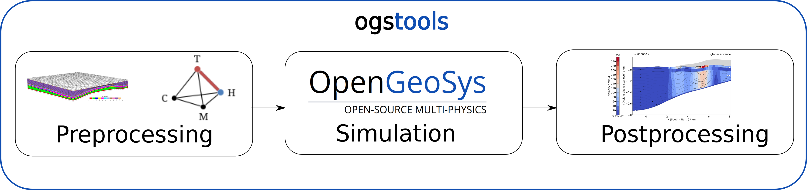

# Project description

 is a:

- python library to for streamlined usage of [opengeosys](opengeosys.org)

- set of interconnected modules for pre- and postprocessing of simulations with [opengeosys](opengeosys.org)

- valuable resource that includes documentation, Jupyter notebooks, and workflows for guidance and reference.

# Overview

- **Website:** https://www.opengeosys.org

- **Documentation:** https://ogs.ogs.xyz/tools/ogstools

- **Source code:** https://gitlab.opengeosys.org/ogs/tools/ogstools

- **Contributing:** https://ogs.ogs.xyz/tools/ogstools/development/index.html

- **Bug reports:** https://discourse.opengeosys.org

# Install

Install the latest version of ogstools:

`pip install ogstools`

For further details see the [User Guide](https://ogs.ogs.xyz/tools/ogstools/user-guide/index.html).

# Getting started

For first steps, please take a look at our [examples](https://ogs.ogs.xyz/tools/ogstools/auto_examples/index.html).

# Contribution

Please report bugs on [discourse](https://discourse.opengeosys.org) or fork the repository on our [GitLab](https://gitlab.opengeosys.org/ogs/tools/ogstools) and create a merge request. We also welcome contributions in the form of merge requests and are here to assist in ensuring that the code passes all quality checks. We recommend starting with the [Developer Guide](https://ogs.ogs.xyz/tools/ogstools/development/index.html) as your initial point of reference.

You may also contribute by [donating](donation.md) your existing code snippets.

# Related projects

- [ogs](https://pypi.org/project/ogs)
- [ogs6py](https://pypi.org/project/ogs6py)
- [VTUInterface](https://pypi.org/project/VTUinterface)

# License

OpenGeoSys is distributed under the Modified BSD License. See the
LICENSE.txt for the license text.
