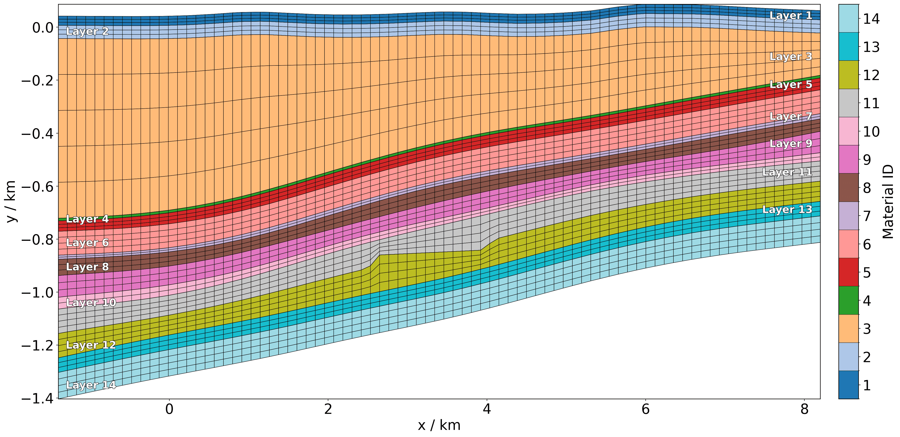
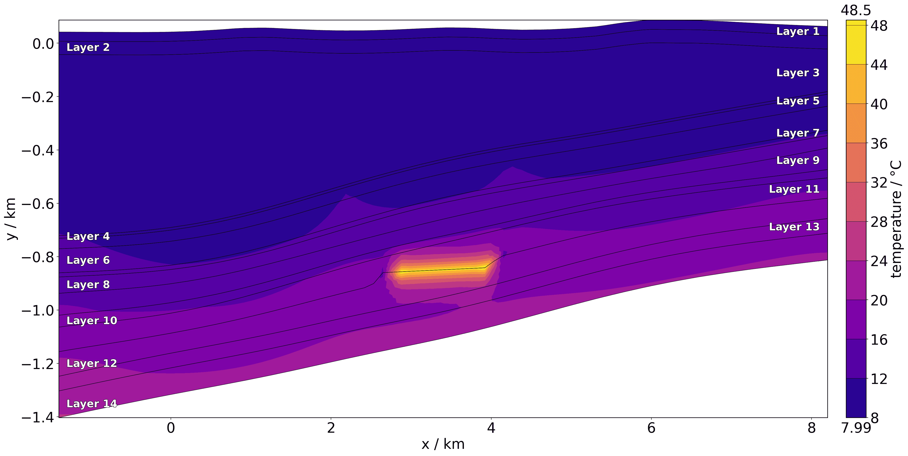
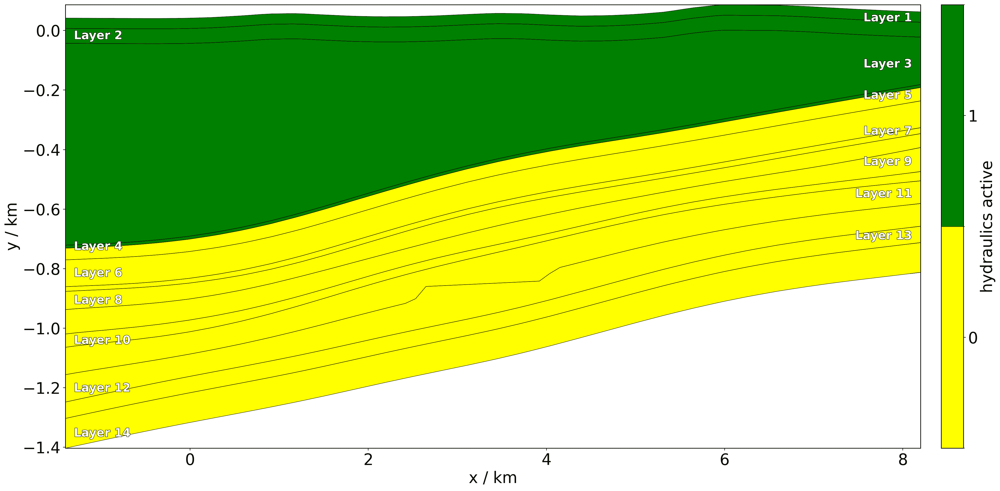
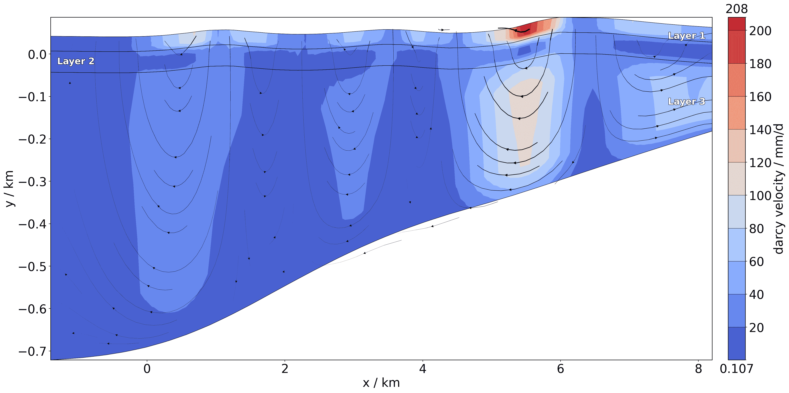
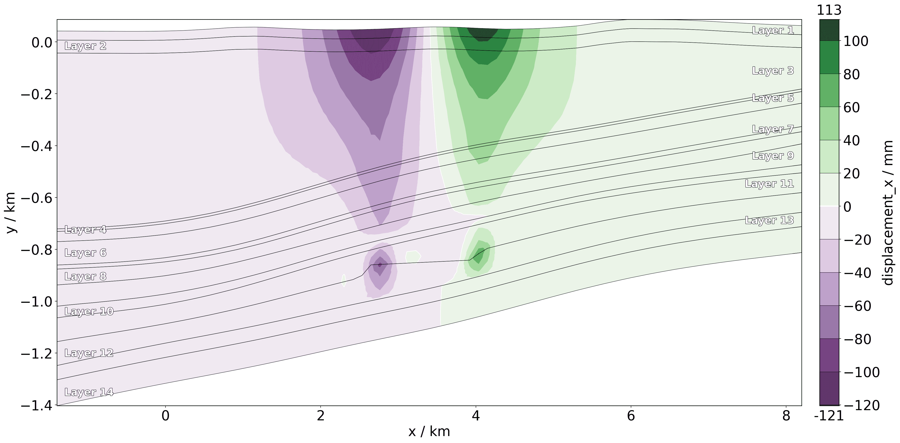
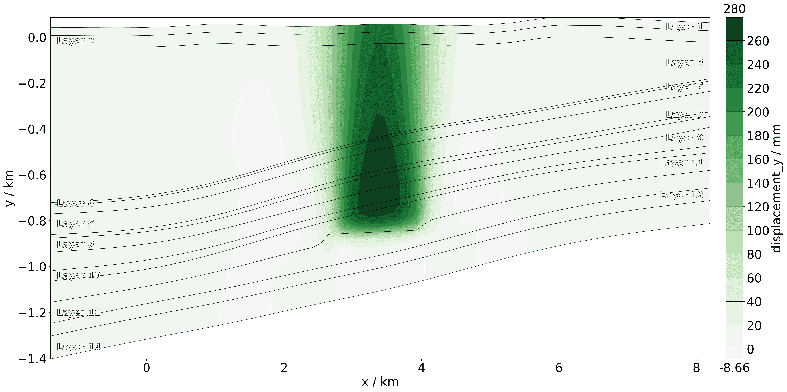
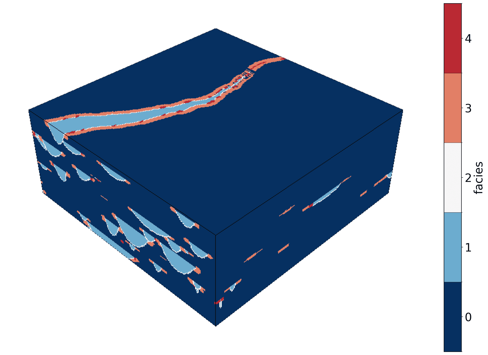
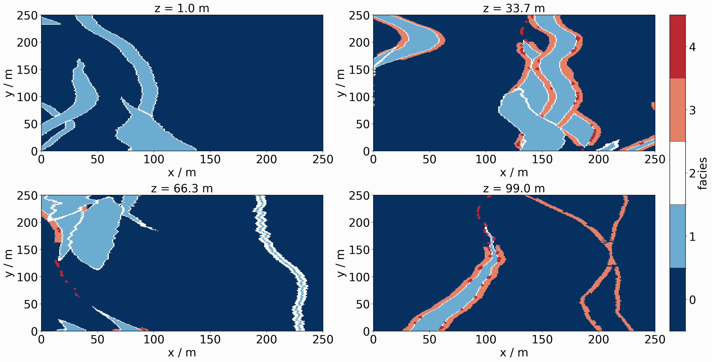
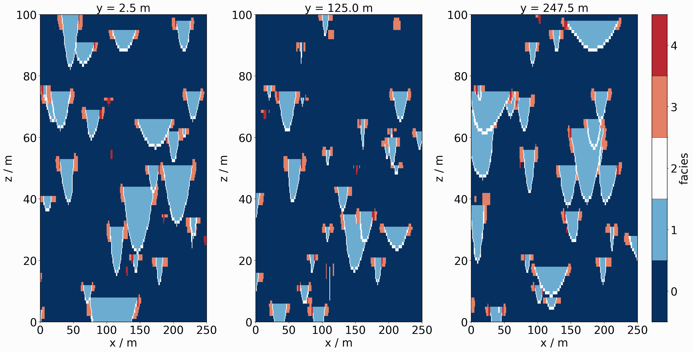
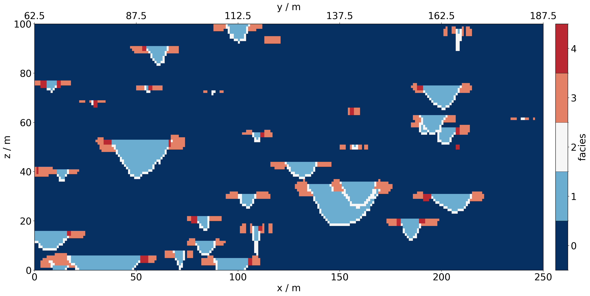

# How to use meshplotlib

```{eval-rst}
.. sectionauthor:: Florian Zill (Helmholtz Centre for Environmental Research GmbH - UFZ)
```

## Visualizing 2D model data

For this example we load a 2D meshseries dataset from within the `meshplotlib` examples.
In the `meshplotlib.setup` we can provide a dictionary to map names to material ids.
First, let's plot the material ids (cell_data). Per default in the setup, this
will automatically show the element edges.

```python
import ogstools.meshplotlib as mpl
from ogstools.propertylib import THM, ScalarProperty

mpl.setup.reset()
mpl.setup.length.output_unit = "km"
mpl.setup.material_names = {i + 1: f"Layer {i+1}" for i in range(26)}
meshseries = mpl.MeshSeries("../../../ogstools/meshplotlib/examples/2D.pvd")
fig = mpl.plot(meshseries.read(0), property=THM.material_id)
```



Now, let's plot the temperature field at the first timestep.
The default temperature property form the `propertylib` reads the temperature
data as Kelvin and converts them to degrees Celsius.

```python
fig = mpl.plot(meshseries.read(1), property=THM.temperature)
```



This example has hydraulically deactivated subdomains:

```python
fig = mpl.plot(
    meshseries.read(1),
    ScalarProperty(
        data_name="pressure_active",
        data_unit="",
        output_unit="",
        output_name="hydraulics active",
    ),
)
```



Let's plot the fluid velocity field on the hydraulically active part of the model.

```python
fig = mpl.plot(meshseries.read(1).threshold((1, 3), "MaterialIDs"), THM.velocity)
```



We can also plot components of vector property:

```python
fig = mpl.plot(meshseries.read(1), THM.displacement.component(0))
fig = mpl.plot(meshseries.read(1), THM.displacement.component(1))
```




## Visualizing 3D model data

For visualizing 3D data it might make sense to plot multiple views / slices.
To create them we use `pyvista` as it provides all the necessary functionality.
If we want to plot multiple meshes, they have to be in a 2D `numpy` array.
The shape of this array determines the number of rows and columns in our plot.
First, let's load 3D example data from `pyvista` and plot an isometric view of
the only available dataset: "facies".

```python
import numpy as np
from IPython.display import Image, display
from pyvista import examples

import ogstools.meshplotlib as mpl
from ogstools.propertylib import ScalarProperty

mpl.setup.reset()
mesh = examples.load_channels()
fig = mpl.plot(mesh, ScalarProperty("facies"))
```



Now, let's create multiple slices along the z axis and plot them in a 2 by 2 grid.

```python
slices = np.reshape(list(mesh.slice_along_axis(n=4, axis="z")), (2, 2))
fig = mpl.plot(slices, ScalarProperty("facies"))
for ax, slice in zip(fig.axes, np.ravel(slices)):
    ax.set_title(f"z = {slice.center[2]:.1f} {mpl.setup.length.data_unit}")
```



We can also slice along the y-axis and plot the meshes in one row.

```python
slices = np.reshape(mesh.slice_along_axis(n=3, axis="y"), (1, -1))
fig = mpl.plot(slices, ScalarProperty("facies"))
for ax, slice in zip(fig.axes, np.ravel(slices)):
    ax.set_title(f"y = {slice.center[1]:.1f} {mpl.setup.length.data_unit}")
```



Arbitrary oriented slices are also possible.
They get projected to the cardinal plane, from which they have the least rotational offset.

```python
fig = mpl.plot(mesh.slice([1, -2, 0]), ScalarProperty("facies"))
```


