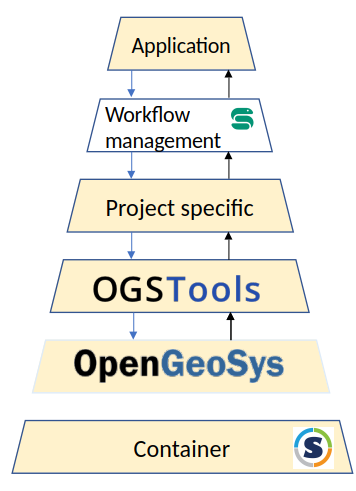

# Motivation

## Problem statement

Python is utilized in numerous [OpenGeoSys(OGS)](https://www.opengeosys.org)-related projects, spanning both the preparation and assessment of simulation results. Our positive experience with [ogs6py](https://github.com/ufz/ogs6py) and [VTUInterface](https://github.com/ufz/vtuinterface) highlights the community's strong reliance and extensive usage of these tools. However, the identified need for a wider spectrum of functionalities remains, essential for catering to the diverse requirements across various projects. OGSTools aims to address this need by expanding functionalities to accommodate past requirements and current project-specific needs.

## Target audience

OGSTools is for OpenGeoSys users and developers aiming to effectively automate their pre- and post-processing tasks (workflows). Proficiency in basic Python, accompanied by knowledge of essential libraries like [Pandas](https://pandas.pydata.org/), [NumPy](https://numpy.org/), [Matplotlib](https://matplotlib.org/) in addition to familiarity with [OpenGeoSys - Benchmarks](https://www.opengeosys.org/docs/benchmarks/), constitutes the required skill level.

## Functionality and unique features

OGSTools consists of features designed specifically for [OpenGeoSys](https://www.opengeosys.org) but can be applied broadly across multiple [OpenGeoSys](https://www.opengeosys.org)-specific projects. The functionality is grouped  thematically into sub-libraries that are developed to collaborate with each other.

## Versatility and Flexibility

All sub-libraries either

- transform from [OpenGeoSys](https://www.opengeosys.org) specific data into data structure of common python libraries
- transform from data structures of common libraries to [OpenGeoSys](https://www.opengeosys.org) specific data
  This compatibility enables [OpenGeoSys](https://www.opengeosys.org) users to harness the full potential of Python's extensive ecosystem.

## Community Support and Maintenance

OGSTools is part of the core development (with a dedicated team of developers). Progress is mainly made by project-specific requests. It is ready for broader adoption with the OGS Community.

## Use Cases

### Projects

- [AREHS](https://www.ufz.de/index.php?en=47155) - OGSTools extracted from and used within a [snakemake](https://snakemake.readthedocs.io) based complex workflow
- [OpenWorkflow](https://www.ufz.de/index.php?en=48378) - OGSTools used within a workflow for thermal dimensioning of a deep geological repository, OGSTools infrastructure setup was used as a template (e.g. for project setup, testing, documentation generation, ...)
- [OpenGeoSys - Benchmarks](https://www.opengeosys.org/docs/benchmarks/)

### Workflows

Larger workflows have been constructed using the workflow manager [snakemake](https://snakemake.readthedocs.io). Within its main building blocks, called [rules](https://snakemake.readthedocs.io/en/stable/snakefiles/rules.html) the functionality of OGSTools is combined with generic Python libraries or [OGS Command Line Tools](https://www.opengeosys.org/docs/tools/getting-started/overview/). We see that workflows are specific to the project but should be assembled from components that are generic. Ideally, the amount of project-specific code is significantly smaller than the generic project code. Therefore, we tend to invest a considerable portion of our development effort in establishing a robust foundation for the software stack described in the image below. We have basic experience with other workflow managers (e.g. [Parsl](https://parsl-project.org/) and [AiiDA](https://www.aiida.net/)) to confirm compatibility and ensure that our code will function seamlessly across different workflow manager environments.

### Roadmap

- Integration of existing [OGS log file parser](https://github.com/joergbuchwald/ogs6py/tree/master/ogs6py/log_parser)
- Integration of [ogs6py](https://github.com/ufz/ogs6py)
- Integration of [VTUInterface](https://github.com/ufz/vtuinterface)
- Scalability study
