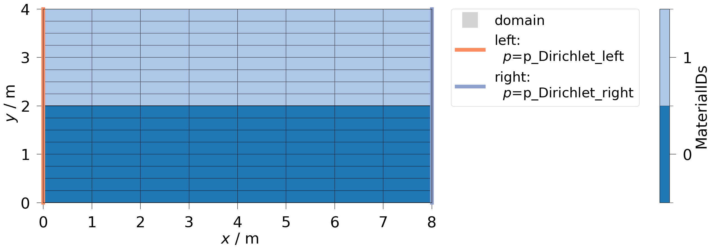
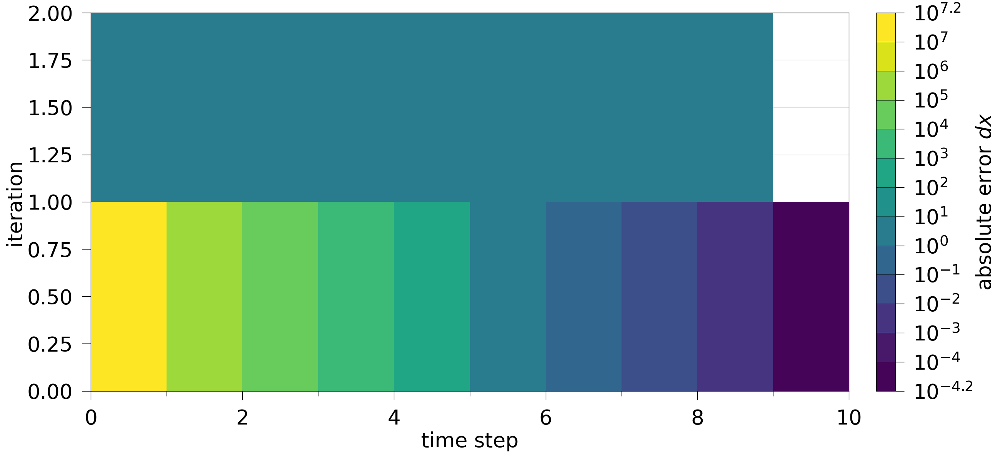
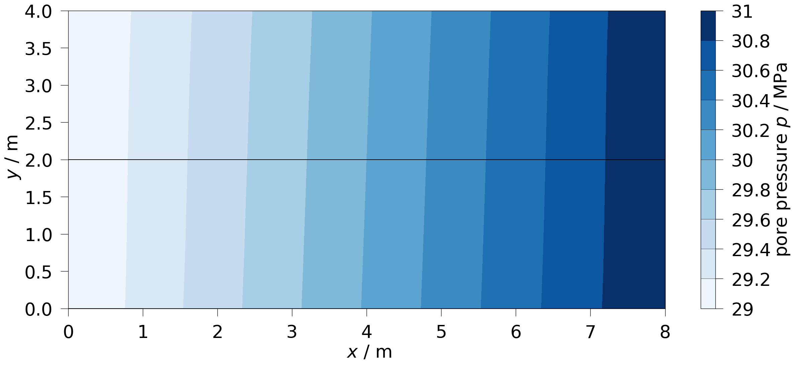

## Summary

`OGSTools` (`OpenGeoSys` Tools) is a Python library for pre- and post-processing of `OpenGeoSys 6` (OGS) — a software package for simulating \mbox{thermo-hydro-mechanical-chemical} (THMC) processes in porous and fractured media \[@bilke_2025_14672997\] \[@kolditz2012opengeosys\].
`OGSTools` \[@ogstools2025\] provides an interface between OGS-specific data and well-established data structures of the Python ecosystem, as well as domain-specific solutions, examples for OGS users and developers. The library's functionalities are designed to be used in the OGS benchmark gallery, the OGS test suite, and for automating repetitive tasks in the model development cycle — from simple daily tasks to complex automated workflows.

## Statement of need

### Development efficiency

Modellers of OGS iteratively run simulations, analyse results, and refine their models. To improve efficiency, repetitive steps in the model development cycle are formalised in Python, matching the existing expertise of the user base.
The Python library introduced here serves as a central platform to collect and improve common functionalities needed by modellers of OGS.

### Complex workflows

In our scientific research, workflows integrate multiple steps — geological data preprocessing, ensemble simulations with OGS, domain-specific analysis and visualisation — into fully automated, reproducible sequences. Workflow-based approaches adhere to the `FAIR principles` \[@goble2020fair\], \[@Wilkinson_2025\], using workflow management software for dependency management, execution control, and data provenance \[@Bilke2025\]. Building on Python-based workflow managers like `Snakemake` \[@Köster2012\] and `AiiDA` \[@Huber2020\], OGSTools provides reusable, domain-specific functionality as the shared foundation across workflow components.

### Test suite

`OGSTools` provides functionality for (1) setting up test environments, (2) executing OGS under specified conditions, (3) evaluating OGS results against defined test criteria, and (4) monitoring the testing process.

### Educational Jupyter notebooks

OGS is already being used in academic courses and teaching environments. With Jupyter Notebooks, students can explore interactive learning environments where they directly modify parameters, material laws, and other influencing factors, and instantly visualise the outcomes. OGSTools reduces the boilerplate and keeps notebooks focused on the learning objective.

### Decentralised code


## State of the field

Simulator-specific companion libraries have emerged as a recurring pattern across scientific computing domains. These software packages bridge a domain-specific simulator to a general-purpose programming language ecosystem (e.g. Python), typically to cover pre-processing, execution, and post-processing conducted on a single programmatic platform.

In subsurface hydrology, FloPy [@Hughes2024] wraps the MODFLOW family of groundwater flow and transport models, supporting model creation, execution, and result analysis including unstructured grids. pyGSFLOW [@Larsen2022] provides equivalent functionality for the GSFLOW integrated hydrologic model. toughio [@Luu2020] covers pre- and post-processing for the TOUGH simulator family. In energy systems modelling, otoole [@Barnes2023] supports users of OSeMOSYS to formalise pre- and post-processing tasks. DOLFINx [@Baratta2023] is worth noting despite a fundamental architectural difference: rather than wrapping an external solver such as OGS, it exposes FEM assembly and solving directly through a Python API. It partially shares the same tooling ecosystem as OGSTools — gmsh, PyVista, and VTK/XDMF.

OGSTools follows the simulator-specific companion library pattern, here for OpenGeoSys.

An alternative to scripting-based companion libraries is a dedicated companion GUI — as with ModelMuse [@Winston2019] for MODFLOW and the DataExplorer [@Rink2012] for OpenGeoSys.

## Software Design

### Build vs. contribute

OGSTools contains only functionality that is explicitly specific to [OpenGeoSys](https://www.opengeosys.org) — domain-specific data structures, OGS input/output formats, and process-specific defaults. General-purpose functionality is deliberately left to established libraries (PyVista, Pandas, NumPy, Pint), which OGSTools relies on.

Previously, without any centralisation to contribute OGS-specific pre- and postprocessing code, the code base for Python-related tasks in OGS was fragmented, with components often developed for specific use cases and varying degrees of standardisation, quality and maintenance efforts.
Further, it enables the transfer of years of experience in maintaining the OGS core \[@Bilke2019\] to the pre- and post-processing code.
For the centralised approach, preceding work on `msh2vtu` \[@msh2vtu\], `ogs6py and VTUInterface` \[@Buchwald2021\] and further not yet published functionalities have been adapted and integrated into `OGSTools`.

### Design choices

The functionality is grouped thematically into sub-libraries. Beyond general software engineering best practices, the following design principles deserve particular attention.

**Open interfaces to common Python libraries:** Each sub-library either transforms OpenGeoSys specific data into common Python data structures (e.g. PyVista, Pandas, NumPy, Matplotlib, Pint), or vice versa. Users can use any subset of the library without lock-in, including when preferring to run OpenGeoSys from the command line.

**Reuse OGS command line tools:** The new functionality combines the OGS command line tools [^5] to cover more complex tasks than any single tool can handle alone.

**Fail loudly:** Silently producing wrong results is the highest risk in our simulation workflows. OGSTools therefore raises errors immediately when constraints or plausibility checks are violated, prioritizing early failure over silent pass-through.

**Large data awareness:** Meshes can exceed one million cells. The top-level API is designed to be approachable for small datasets at entry level, while experts working with large data can tune performance via lower-level API access or fall back to command-line tools and custom code.

**Infrastructure:** Code development is centralised on a self-hosted GitLab instance. A multi-platform CI pipeline (Linux, Windows, macOS) enforces code quality and reports test coverage on every merge request. Examples are organised as plain Python scripts automatically converted to Jupyter notebooks, with Binder integration for every release. To address the need for a versioned analysis environment [@Blomer2014], OGSTools ships a pinned dependency environment updated with every release, while continuously tested against the latest dependencies.

### Example

The following example shows a complete `OGS` Liquid Flow [^2] simulation workflow, adapted to 2D from [^3].
First, an OGS-capable mesh is generated and pressure boundary conditions are assigned to the boundary meshes (\autoref{fig:bc}), using standard `pyvista` functionality.
After execution of the simulation, convergence metrics (\autoref{fig:convergence}) and the final pressure distribution (\autoref{fig:pressure}) are visualised. An extended version of this example is available in the OGSTools documentation [^4].

```python
import numpy as np
import ogstools as ot
from ogstools.examples import load_project_simple_lf

# 1. Pre-processing: Load example Project and construct input meshes
project = load_project_simple_lf()
meshes = ot.Meshes.from_gmsh(ot.gmsh_tools.rect((8,4),8,2))
# Set boundary conditions on the pyvista meshes
meshes["left"].point_data["pressure"] = 2.9e7
meshes["right"].point_data["pressure"] = 3.1e7
model = ot.Model(project=project, meshes=meshes)
# Visualize setup with boundary conditions (Figure 1)
model.plot_constraints()

# 2. Run: Execute Simulation
sim = model.run()

# 3. Post-processing: Analyse results
# Plot final pressure distribution (Figure 2)
ot.plot.contourf(sim.meshseries[-1], "pressure")
# Plot convergence behaviour (Figure 3)
sim.log.plot_convergence()

# 4. Store: Save Simulation
sim.save(id = "mysim", archive=True)
```

{#fig:bc width="80%"}

{#fig:convergence width="80%"}

{#fig:pressure width="80%"}

## Features

The implemented features cover pre-processing, setup and execution of simulations, and post-processing.

Pre-processing for OGS includes mesh creation, adaptation, conversion, as well as defining boundary conditions, source terms, and generating project files (OGS-specific XML files). OGSTools further provides a material management component that allows process-specific material definitions to be assembled from structured YAML sources and translated into OGS-compatible project file entries. This allows a consistent, database-like handling of material parameters across workflows, test cases, and educational examples, while separating physical model definitions from project file syntax. In addition, a `FEFLOW` converter (from `FEFLOW` models to OGS models) is integrated \[@Heinze2025\].

The simulation execution part covers running simulations with the `OGS` core via the command line and Python-based co-simulation interfaces. Runtime features include monitoring, interactive stepping, and access to intermediate results for in-simulation analysis.

Post-processing includes domain-specific evaluation and visualisation of simulation results for temporal and spatial distribution analysis, with sensible defaults and OGS-specific standards for plotting, and comparison against experimental data or analytical solutions.

The complete feature list is found in the online documentation [^1].
Containers are provided for reproducibility, benefiting both developers and users \[@Bilke2025\].
Like `OpenGeoSys`, `OGSTools` is available on `PyPI` and `Conda`.

## Research impact

### Workflows

OGSTools emerged from and is used in the following research projects. The AREHS-Project \[@Kahnt2021\] is focused on modelling the effects of the glacial cycle on hydro-geological parameters in potential geological nuclear waste repositories in Germany. Within this project, \[@Zill2024\] and \[@Silbermann2025\] demonstrated automated workflows using OGSTools functionality for model development and reproducibility, with all material available at \[@arehs2024\]. `OpenWorkFlow` \[@lehmann2025\] is a project for an open-source, modular synthesis platform designed for safety assessment in the nuclear waste site selection procedure of Germany. `ThEDi`, a completed study on optimal disposal container packing to meet repository temperature limits, is one of multiple studies within `OpenWorkFlow`, mostly implemented using OGSTools.

### OpenGeoSys benchmarks

The OGS benchmark gallery is a collection of web documents (mostly generated from `Jupyter Notebooks`) that demonstrate how users can set up, adjust, execute, and analyse simulations. They are well-suited as a starting point of research, and can be downloaded, executed, and adapted interactively. With `OGSTools`, code complexity and code duplication have been reduced, and it allows especially inexperienced users to focus on the important part of the notebook.

## AI usage disclosure

In the writing of this manuscript, the authors used Anthropic's Claude and OpenAI's ChatGPT for grammar and spelling corrections. For all contributions to the software project the use of Large Language Models (LLMs) is in principle permitted, but all contributions must pass through a review process by the developers, maintainers, and authors.

## Acknowledgements

This work has been supported by multiple funding sources, including `AREHS` under grant 4719F10402 by `Bundesamt für die Sicherheit der nuklearen Entsorgung (BASE)`, and `OpenWorkFlow` under grant STAFuE-21-05-Klei by `Bundesgesellschaft für Endlagerung (BGE)`.
The authors also acknowledge ongoing support from `SUTOGS` (Streamlining Usability and Testing of OpenGeoSys) under (grant \[Grant Number\]) by `Deutsche Forschungsgemeinschaft` (DFG)

[^1]: https://ogstools.opengeosys.org
[^2]: https://www.opengeosys.org/6.5.7/docs/processes/liquid-flow/liquidflow/
[^3]: https://www.opengeosys.org/6.5.7/docs/benchmarks/liquid-flow/primary-variable-constrain-dirichlet-boundary-condition/
[^4]: https://ogs.ogs.xyz/tools/ogstools/auto_examples/howto_quickstart/plot_framework.html
[^5]: https://www.opengeosys.org/6.5.7/docs/tools/getting-started/overview/

## References
